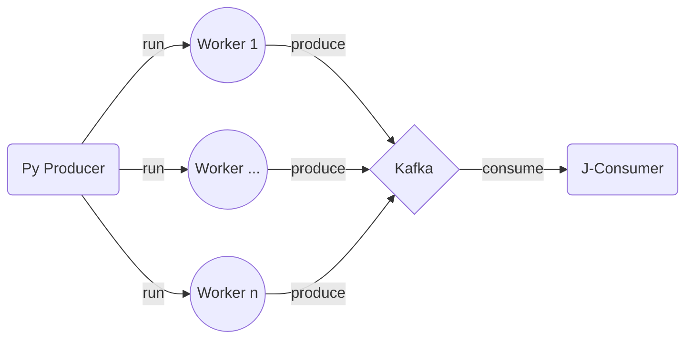

# DataOpsBox

Local K8s cluster orchestrating Docker containers with Minikube  to trial and demonstrate applied DevOps in a distributed data engineering lifecycle.

***

## Overview



## Getting started

1. Install [Docker CLI](https://docs.docker.com/engine/reference/commandline/cli/) and [minikube](https://minikube.sigs.k8s.io/docs/ "Minikube Homepage"). You don't need Docker Desktop necessarily. I use [colima](https://github.com/abiosoft/colima).
2. Provide sufficient CPU and memory (e.g. 4, 8g) when starting minikube:

```shell
minikube start --cpus 4 --memory 8g
```
3. Install [kubens](https://github.com/ahmetb/kubectx) for convenience