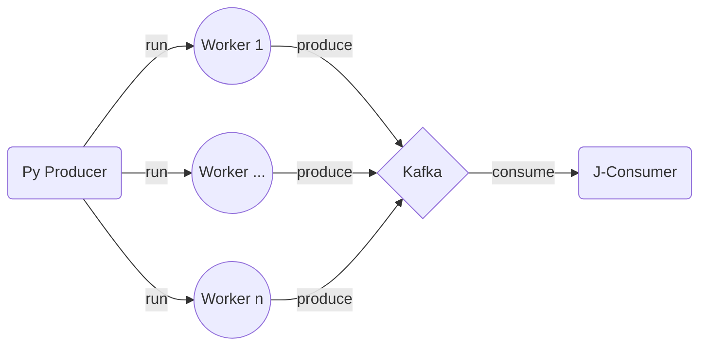

# DataOpsBox

Local K8s cluster orchestrating Docker containers with Minikube  to trial and demonstrate applied DevOps in a distributed data engineering lifecycle.

***

## Prerequisites

- Install [Docker CLI](https://docs.docker.com/engine/reference/commandline/cli/) and [minikube](https://minikube.sigs.k8s.io/docs/ "Minikube Homepage")
- Provide sufficient CPU and memory (e.g. 4, 8g)

